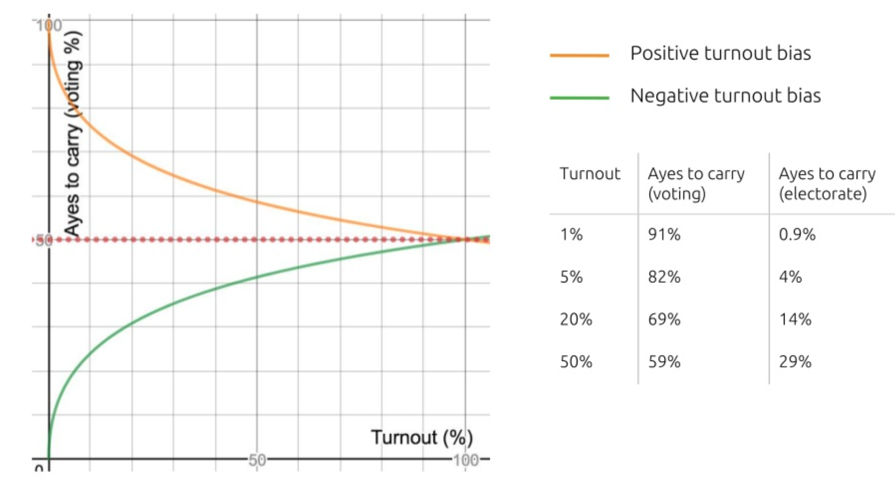

Democracy Module
================

IMPORTANT: You're Invited
----------------
Joshy Orndorff will host a live peer-learning sessions that covers and experiments with the democracy module on Friday March 29th for anyone interested in attending.

Overview
--------
The democracy module facilitates on-chain governance and makes up an important part of polkadot's own governance as explained by Gav in [these slides](https://www.slideshare.net/gavofyork/governance-in-polkadot-poc3).

In particular the democracy module handles the circled portion of polkadot governance.


Democracy allows anyone who is willing to lock some tokens to make a proposal (mint some tokens, eject a validator, even change the runtime itself), and the most important proposals become referenda and are voted on.

To discourage short-sighted or spiteful voting and encourage thoughtful calculated voting, the module requires voters whose side won to lock some tokens for a period after the referendum in enacted. Thus if the result of a referenda hurts the value of the chain, those who are responsible for the decision must hold on to their tokens allowing their opposition to sell off before the bulk of the crash.

The module's rust code lives at: [https://github.com/paritytech/substrate/tree/master/srml/democracy](https://github.com/paritytech/substrate/tree/master/srml/democracy)

Mechanics
---------
### Proposals
Anyone may make a proposal at any time. So that voters don't need to worry about a thousand trivial proposals all at once, only one proposal (the one with the highest deposit) is tabled every period (Default 9 blocks). If you're curious, check out the [rust code](https://github.com/paritytech/substrate/blob/master/srml/democracy/src/lib.rs#L86-L107).

### Seconding
When someone makes a proposal that is important to you, you may add to its deposit to help get it tables faster by seconding it. Seconding simply means locking up the same amount of tokens as the original staker. If you're curious, check out the [rust code](https://github.com/paritytech/substrate/blob/master/srml/democracy/src/lib.rs#L109-L118).

Tokens locked when proposing and seconding are [released](https://github.com/paritytech/substrate/blob/master/srml/democracy/src/lib.rs#L401) as soon as (and only when) the proposal is tabled.

In my opinion this is not ideal because it means someone who supported an unpopular proposal in a busy democracy, will never be able to "give up" on their pet issue and get their tokens back.

### Voting on Referenda
Once a proposal has been tabled it is open for voting for a predetermined number of blocks (18 by default). Any token holder is eligible to vote on the referendum. The token holder's vote is proportional to the number of tokens they chose to lock and the amount of time they chose to lock the tokens for.


After the voting closes, any voter who "didn't get her way" receives their locked tokens back immediately. That is to say if a referendum passes, all voters who voted against it, or if a referendum fails, all voters who voted in favor.

### Turnout Biasing
Real-world democracies often require a simple majority of the voters who bothered voting to support a referendum before it is ultimately accepted. Such a system has the drawback that when voter turnout is low, a vocal minority can affect the system against those who didn't turn out. Thus one must always keep an eye on governance even when they are happy with the status quo.

The SRML's democracy module solves this problem by varying the threshold of votes to pass a referendum as the voter turnout varies. In short, lower voter turnout requires a higher margin of support to pass a motion. (When the council proposes a motion, the turnout biasing can be set manually).

Gav shows this dynamic effectively in this slide.


### Directly Creating and Canceling Referenda
Looking back at the figure illustrating polkadot's governance, you'll notice that the council can also create and cancel referenda directly. While such features are not exposed directly to end users, they are included in the democracy module's code so it can [work with the council module](https://github.com/paritytech/substrate/blob/master/srml/democracy/src/lib.rs#L341-L352).

### Delegation
The ability to delegate ones vote was to the democracy module recently. Imagine that Alice cares about some issue, but is unable to vote on it herself (maybe she doesn't have time or ability the nuanced arguments around the issue), but she trusts her friend Bob to vote on her behalf. With delegation, Alice can explicitly attach her tokens to the vote that Bob casts.

Because delegation was added to the module recently, it is not yet supported by the polkadot UI. This means that, for one thing, users cannot delegate their votes through that interface. But it also means that the interface does not correctly count votes that were delegated.

I'm planning to add [such functionality](https://github.com/polkadot-js/apps/issues/836) to the interface as soon.

Starting a Development Chain
---------------
Luckily the pre-baked substrate node comes with the democracy module already installed, so we will not need to compile our own node for this portion of the tour. You can start a node with `substrate --dev` and connect to it with the polkadot UI just as we did in the intro.

Scenario 1 -- Give Alice free tokens
----------------------------------------
To get our feet wet, consider this scenario. Alice is a developer for our blockchain and she recently fixed a security-critical bug before it was exploited. Her fix prevented many grateful community members from being robbed. One such community member proposes that in appreciation Alice should be awarded 100 newly-minted tokens.

We'll explore several ways the scenario could unfold from here, but first a word about timing, experimentation, and patience. As we explore these scenarios, we will use a live development chain and the [Polkadot-JS UI](https://github.com/polkadot-js/apps). It is likely that you will occasionally issue the extrinsics out of order, too quickly, or too slowly. It is likely that you will need to restart the scenario a few times before getting it right. While this can sometimes be frustrating, remember that this is how you learn. The more times you practice, the more familiar you will become with the democracy module. Remember you can change the block time by modifying your chainspec file if you need to.

### Only Cheap Charlie Proposes
In the first scenario, Charlie proposes that Alice get the new tokens. Charlie, being a cheapskate, only supports the proposal with 5 tokens. This is less than the minimum deposit, so the proposal is immediately rejected.

TODO timing diagram?

Begin by going to the extrinsics tab in the UI, we can have charlie submit a proposal. ([Extrinsics](https://docs.substrate.dev/docs/glossary#section-extrinsic) are transactions and things like blocktime. In this case, just think transactions.)

TODO screenshot

When the next block is added to the chain, we see that the extrinsic failed because Charlie didn't deposit enough tokens.

### Charlie proposes, Bob seconds, Referendum Passes
TODO

### Charlie proposes, No seconds, Referendum Fails
TODO
query how many tokens are locked up at this point

### Charlie Proposes, Other proposal more popular
TODO

### Automating Scenarios
For all the reasons we discussed earlier, always using UI interactively is tiresome and error-prone. We can automate scenarios like this by using the same polkadot-js api that we used in the introduction. While we won't dwell on this automation, here is an example of the previous scenario.

```javascript
//TODO Write this together during peer-learning session
```

Democracy Settings in the Chainspec
-----------------------------------
Just like we changed blocktime, and initial token balances by modifying the chainspec, we can change several properties of the democracy module. The settings are found at the bottom of the file after the large wasm blob.

```json
"democracy": {
  "launchPeriod": 9,
  "minimumDeposit": 10,
  "publicDelay": 7,
  "maxLockPeriods": 6,
  "votingPeriod": 18
}
```

For starters, let's change the minimum deposit to 3 tokens. This will allow cheapskate Charlie's proposal to go through. While we're at it let's change the public delay. This property determines how many blocks must elapse after a referendum is passed before it is enacted.

Navigating back to the interface, and executing the very first scenario above, we see that now Charlie's proposal is accepted because the minimum deposit has been lowered.


Scenario 2 -- Bob wants to be super user
----------------------------------------
The dev chain (and the slightly customized chain we just created) includes the sudo module. sudo allows a single user, the "super user" to execute extrinsics with higher authority than usual. Essentially whoever is the super-user is the king of the blockchain. This module is super useful for building and debugging a blockchain, but not a great governance strategy in a public chain. Since we have it, let's use it as an example proposal.

When the chain is launched, Alice is the super user. Bob, thinking he would be a better super user than Alice, proposes that he be the new super user. some of his friends think that's a good idea.

### Referendum Outvoted
This is just a simple exercise.

### Alice cancels referendum
by using her existing sudo capabilities

### Over 50% support, but motion fails due to turnout bias
Bob votes Aye, Charlie votes Nay, charlie has 51% vote, but turnout bias means motion fails anyway.

Future Content
--------------
* Fix how the UI shows vote weights
* Add interface elements for delegation
* Demonstrate how delegation works more thoroughly
