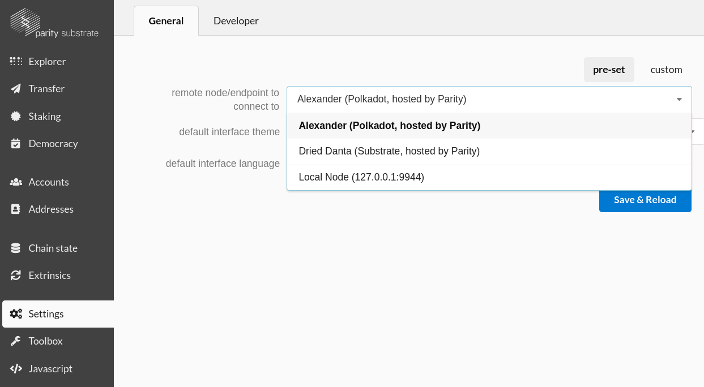

Using Substrate
===============

Substrate can be [used in many ways](https://github.com/paritytech/substrate#3-usage). This tour will focus on blockchain nodes that are based on runtime modules.

Install Substrate
-----------------
The documentation for [installing substrate](https://docs.substrate.dev/docs/getting-started) is the best place to start. The one-liner they promote is
`curl https://getsubstrate.io -sSf | bash`. It will probably take about half an hour to download and compile the rust code.

That command will download code from the internet and ask you to run it as root, which can be dangerous. So while it runs, let's [look at the code](https://getsubstrate.io) and learn what we just installed.

The majority of that script detects what operating system you're on and makes sure some prerequisites are in place. We'll focus on the bottom where it gets interesting.

### Rustup
```sh
if ! which rustup >/dev/null 2>&1; then
	curl https://sh.rustup.rs -sSf | sh -s -- -y
	source ~/.cargo/env
else
	rustup update
fi
```
[Rustup](https://rustup.rs/) is an installer for the programming language rust. Substrate is written in rust, and we're going to be compiling some rust, so we need to install it. Using rustup ensures that we have a recent version. This snippet checks whether rustup is installed, and either installs or updates it.


### Substrate and Subkey

This snippet contains the secret that you can use the `--fast` flag to skip installing substrate and subkey. They take a lot of the installation time.

```sh
if [[ "$1" == "--fast" ]]; then
	echo "Skipped cargo install of 'substrate' and 'subkey'"
	echo "You can install manually with:"
	echo "    cargo install --force --git https://github.com/paritytech/substrate subkey"
	echo "    cargo install --force --git https://github.com/paritytech/substrate substrate"
else
	cargo install --force --git https://github.com/paritytech/substrate subkey
	cargo install --force --git https://github.com/paritytech/substrate substrate
fi
```

Assuming you didn't skip them, the two commands in the `else` clause use `cargo` (the rust equivalent of `npm`, `pip`, `cabal`) to install the rust project at the specified git repository locally.

If you plan to do any building on rust, it I suggest you clone the [substrate repository](https://github.com/paritytech/substrate) manually, and run the equivalent commands in that directory.
```sh
# If you want to have the codebase locally and have much faster compiles
git clone https://github.com/paritytech/substrate
cd substrate
cargo install --force --path . substrate
cargo install --force --path . subkey
```

### Substrate-up
```sh
f=`mktemp -d`
git clone https://github.com/paritytech/substrate-up $f
cp -a $f/substrate-* ~/.cargo/bin
```

Just like rustup is nice for rust programmers to quickly get a development environment, [substrate-up](https://github.com/paritytech/substrate-up) is a set of commands that setup templates of things like runtime modules, entire substrate nodes, and userinterfaces.

User Interfaces
--------------
We'll be using the [polkadot-js interface](https://github.com/polkadot-js/apps). The simplest way to start is the [hosted interface](https://polkadot.js.org/apps). It is also possible to run this interface locally by following the instructions in the github linked above. In some parts of the tour we will inspect the interface's code, and even make improvements or modifications to the interface, so eventually you will want to run it locally, but for now the hosted version is sufficient.

When the interface first loads, you are connected to Alexander Polkadot network, a public testnet for polkadot. On the explore tab you can see information about recent blocks, and blocks being produced.

The interface has several other tabs that correspond to block exploring, key/account management, and runtime modules. For example you can see tabs for Staking and Democracy, both of which will be covered in this tour. The user interface is designed to be extensible so that developers can quickly prototype interfaces for their runtime modules. Different blockchains will have different tabs in the UI based on what features their runtime has.




Navigate to the settings tab to just how this interface connects with a blockchain. It is communicating with an actual node running on the Alexander test net over a web socket. Notice we can also connect to a  node on our local system if we like. We'll do that in the next section.

This interface is just one of many possible ways to interact with a node. For instance there is [another popular interface](https://github.com/paritytech/substrate-ui) that works the same way, but looks much different. You could write your own programs that use the websocket interface with this [polkadot-js-api library](https://github.com/polkadot-js/api). If websockets aren't an option you could also connect over the http RPC (default port 9933).


Starting a Development Chain
----------------------------
The fastest way to start a running blockchain is to start the so-called "development chain".

```sh
# Start a Development Chain
substrate --dev
```

After some initial startup messages you should see some blocks getting mined in your terminal.

Switching back to the polkadot UI, we can connect to our node by choosing the bottom option on the settings tab. Once we're connected, we should see the same blocks on the explore tab that we see in the terminal.

The `--dev` flag is a convenience flag that is equivalent to `--chain=dev --validator --key=Alice`. Let's investigate each of these.

`--chain=dev` tells the node to use a particular folder to store the blockchain, and a particular set of parameters for the runtime (things like target block time, and consensus authorities). There are other chain specifications that come with substrate and we can also make our own.

`--validator` tells the node to participate in forming blocks.

`--key=Alice` tells the node to use a built-in key known as "Alice" for signing blocks. You can specify any key here, and there are a few built in. We'll see them in the interface soon.

To learn more about the various substrate flags, run `substrate --help`. I recommend running this often at first.

### Exercise
In addition to the dev chain, there is the staging chain. Try that out. Look at it in the interface. What is different?

Transferring tokens
-------------------
Let's actually use the blockchain by making some token transfers. The dev chain's runtime (and basically all substrate runtimes at the moment) includes the balances module which provides a token to play with. On the polkadot chain the token is called the "DOT".

Connect your polkadot interface to your local development chain, and navigate to the transfer tab. The interface is fairly straightforward, and I encourage you to experiment transferring tokens until you're comfortable with how it works.

### Exercise
The balance module has a parameter known as "existential deposit". Can you figure out what it is? Hint: try transferring all (or almost all) of someone's tokens.

### No Tokens Available?
The `--dev` chain comes with prefunded accounts. But the UI [just got updated] to use the correct prefunded keys. So the hosted UI will not have the correct prefunded accounts loaded. Your options are: 1. host the interface locally. 2. Use the sudo module to mint new tokens you do have access to. 3. Load the new keys into the ui (see below).

Adding Accounts
--------------
The prefunded accounts are fun to play around with, but we will surely want to know how to use our own keys when on a real network.

### Accounts Polkadot UI
In the polkadot UI you can navigate to the account tab, and the the Create account sub-tab. You'll learn these features faster by exploring than by reading, so please play around.

### Accounts with Subkey
When you installed substrate, you most likely installed `subkey` along with it. This command line utility is for generating and recovering keypairs. Running `subkey generate` and `subkey --help` will tell you what you need to know.

### Exercise
Vanity addresses are fun. Try to find an address that contains the name "Al". Now try to find one that contains the name "Alexandria".

Executing Javascript Queries
-----------------------------
The javascript tab in the polkadot UI provides a convenient interface for quick queries to the node. Let's run a few of the examples.

Coding in the browser is not suitable for larger tasks, or frequently run queries. For those situations, you can (with a little more preamble code) execute the same kind of javascript using the [polkadot-js API module](https://github.com/polkadot-js/api) for node.js. Check out some of their excellent [examples](https://polkadot.js.org/api/examples/promise/).

### Exercise
Using a javascript query, determine what block the chain is on. Then determine Alice's token balance.
<!-- console.log(await api.query.balances.freeBalance('5GrwvaEF5zXb26Fz9rcQpDWS57CtERHpNehXCPcNoHGKv3gB')); -->

Chain Specifications
--------------------
So far we've played with the `dev` and `staging` chains that come packaged with substrate. We can play with other chains too, even ones that don't come pre-packaged with substrate.

We can change properties of the blockchain by changing things in the chain specification file or "chainspec" for short. Rather than write one ourselves, let's get a copy of the spec for the dev chain we've been running and make some modifications to it.

```sh
# Generate a chainspec file representing the dev chain
substrate build-spec --dev > customSpec.json
```

(Protip there is a big wasm blob that makes up most of this file. Big enough to cause many text editors to choke. I've found it helpful to always jump to the beginning or end of the file instead of scrolling through the wasm blob.

To see what this file does, we'll modify the block time, and the starting balances. Near the beginning of the file you can set your target block time. This number is off by a factor of 2 due to a [known issue](https://github.com/paritytech/substrate/issues/1493).

```
"genesis": {
  "runtime": {
    "system": null,
    "timestamp": {
      "period": 2   <-- Change this line
    },
    ...
  }
  ...
}
```

Near the bottom we can change the starting token balances as well. Look for this snippet.
```
"balances": {
  "existentialDeposit": 500,
  "transferFee": 0,
  "creationFee": 0,
  "transactionBaseFee": 1,
  "transactionByteFee": 0,
  "balances": [
    [
      "5GrwvaEF5zXb26Fz9rcQpDWS57CtERHpNehXCPcNoHGKv3gB",
      1048576
    ],
    [
      "5FHneW46xGXgs5mUiveU4sbTyGBzmstUspZC92UhjJM696e4",
      1048576
    ],
    ...
  ]
  ...
}
```

Purge your old blockchain data and start a new node.

```sh
# Convert the human-readable chainspec into a "raw" chainspec
# I'm not 100% clear why this is necessary
substrate build-spec --chain=customSepc.json --raw > customRaw.json

# Clear your old blockchain
substrate purge-chain --dev

# Start your new node
substrate --chain=customRaw.json

# Remember you can always look up what commands mean
substrate --help
```

Custom Runtimes
---------------
Changing settings in the chainspec will be sufficient for some applications. Others will need to write their own runtime modules and recompile the node. This process is well-documented in Shawn Tabrizi's excellent [Crypto Collectibles Workshop](https://shawntabrizi.github.io/substrate-collectables-workshop/).

If this guide becomes sufficiently popular that material may be covered here in detail as well. For now you're all set to continue on to the [democracy module tour](Democracy.md).

Potential ideas for this section:
* `substrate-node-new JoshyChain "Joshy Orndorff"`
* build process `./build.sh` `cargo build`
* Add and SRML module to your custom build -- this is why it would be helpful to cover.
